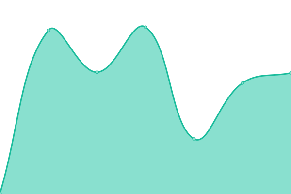
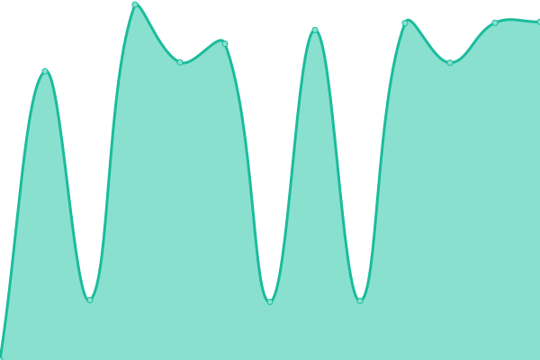
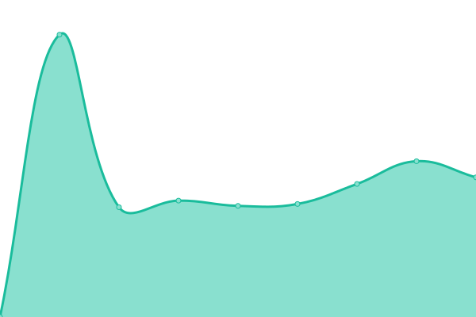
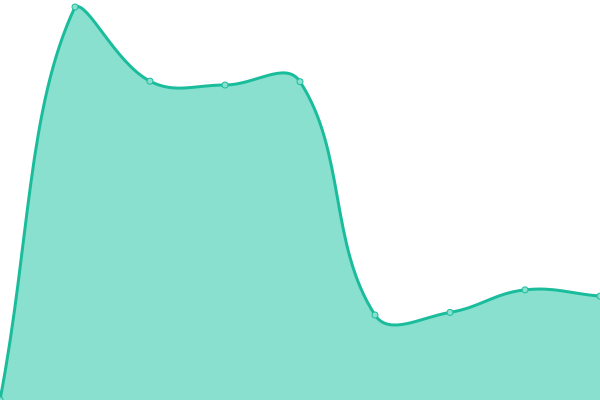
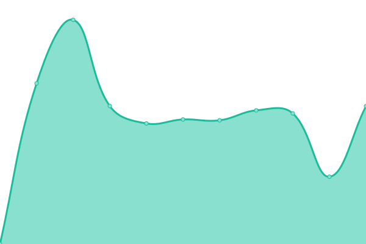

# [📈 Live Status](https://status.andikarekatias.com): <!--live status--> **🟧 Partial outage**

This repository contains the open-source uptime monitor and status page for [Andika Rekatias](andikarekatias.com), powered by [Upptime](https://github.com/upptime/upptime).

With [Upptime](https://upptime.js.org), you can get your own unlimited and free uptime monitor and status page, powered entirely by a GitHub repository. We use [Issues](https://github.com/andikarekatias/upptime/issues) as incident reports, [Actions](https://github.com/andikarekatias/upptime/actions) as uptime monitors, and [Pages](https://status.andikarekatias.com) for the status page.

<!--start: status pages-->
<!-- This summary is generated by Upptime (https://github.com/upptime/upptime) -->
<!-- Do not edit this manually, your changes will be overwritten -->
<!-- prettier-ignore -->
| URL | Status | History | Response Time | Uptime |
| --- | ------ | ------- | ------------- | ------ |
|  [Andika Rekatias](https://andikarekatias.com) | 🟩 Up | [andika-rekatias.yml](https://github.com/andikarekatias/upptime/commits/HEAD/history/andika-rekatias.yml) | 

 148ms
     
 | 

<a href="https://status.andikarekatias.com/history/andika-rekatias">100.00%</a>
    

|  [Mediakepri](https://mediakepri.co.id) | 🟥 Down | [mediakepri.yml](https://github.com/andikarekatias/upptime/commits/HEAD/history/mediakepri.yml) | 

 275ms
     
 | 

<a href="https://status.andikarekatias.com/history/mediakepri">2.79%</a>
    

|  [Beritabatam](https://beritabatam.com) | 🟩 Up | [beritabatam.yml](https://github.com/andikarekatias/upptime/commits/HEAD/history/beritabatam.yml) | 

 6234ms
     
 | 

<a href="https://status.andikarekatias.com/history/beritabatam">99.67%</a>
    

|  [Meutiaranews](https://meutiaranews.co) | 🟩 Up | [meutiaranews.yml](https://github.com/andikarekatias/upptime/commits/HEAD/history/meutiaranews.yml) | 

 1510ms
     
 | 

<a href="https://status.andikarekatias.com/history/meutiaranews">100.00%</a>
    

|  [Lendoot](https://lendoot.com) | 🟥 Down | [lendoot.yml](https://github.com/andikarekatias/upptime/commits/HEAD/history/lendoot.yml) | 

 5174ms
     
 | 

<a href="https://status.andikarekatias.com/history/lendoot">100.00%</a>
    

|  [SMK Real Informatika](https://smkrealinformatika.sch.id) | 🟩 Up | [smk-real-informatika.yml](https://github.com/andikarekatias/upptime/commits/HEAD/history/smk-real-informatika.yml) | 

 4053ms
     
 | 

<a href="https://status.andikarekatias.com/history/smk-real-informatika">100.00%</a>
    

<!--end: status pages-->

[**Visit our status website →**](https://status.andikarekatias.com)

## 📄 License

- Powered by: [Upptime](https://github.com/upptime/upptime)
- Code: [MIT](./LICENSE) © [Anand Chowdhary](https://anandchowdhary.com), supported by [Pabio](https://pabio.com)
- Data in the `./history` directory: [Open Database License](https://opendatacommons.org/licenses/odbl/1-0/)
